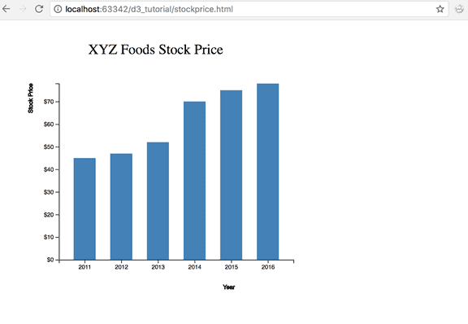
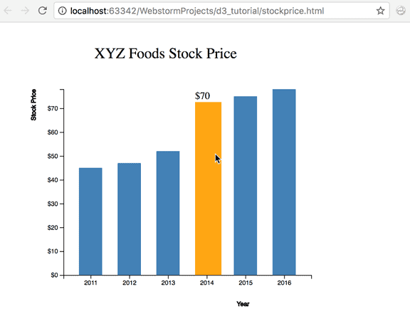

# Examples

## Bar Chart

```csv
year,value
2011,45
2012,47
2013,52
2014,70
2015,75
2016,78
```

```html
<!doctype html>
<html>
<head>
    <style>
        .bar {
            fill: steelblue;
        }
    </style>
    <script src="https://d3js.org/d3.v4.min.js"></script>
<body>
<svg width="600" height="500"></svg>
<script>

    var svg = d3.select("svg"),
        margin = 200,
        width = svg.attr("width") - margin,
        height = svg.attr("height") - margin

    svg.append("text")
       .attr("transform", "translate(100,0)")
       .attr("x", 50)
       .attr("y", 50)
       .attr("font-size", "24px")
       .text("XYZ Foods Stock Price")

    var xScale = d3.scaleBand().range([0, width]).padding(0.4),
        yScale = d3.scaleLinear().range([height, 0]);

    var g = svg.append("g")
               .attr("transform", "translate(" + 100 + "," + 100 + ")");

    d3.csv("XYZ.csv", function(error, data) {
        if (error) {
            throw error;
        }

        xScale.domain(data.map(function(d) { return d.year; }));
        yScale.domain([0, d3.max(data, function(d) { return d.value; })]);

        g.append("g")
         .attr("transform", "translate(0," + height + ")")
         .call(d3.axisBottom(xScale))
         .append("text")
         .attr("y", height - 250)
         .attr("x", width - 100)
         .attr("text-anchor", "end")
         .attr("stroke", "black")
         .text("Year");

        g.append("g")
         .call(d3.axisLeft(yScale).tickFormat(function(d){
             return "$" + d;
         })
         .ticks(10))
         .append("text")
         .attr("transform", "rotate(-90)")
         .attr("y", 6)
         .attr("dy", "-5.1em")
         .attr("text-anchor", "end")
         .attr("stroke", "black")
         .text("Stock Price");

        g.selectAll(".bar")
         .data(data)
         .enter().append("rect")
         .attr("class", "bar")
         .attr("x", function(d) { return xScale(d.year); })
         .attr("y", function(d) { return yScale(d.value); })
         .attr("width", xScale.bandwidth())
         .attr("height", function(d) { return height - yScale(d.value); });
    });
</script>
</body>
</html>
```



## Animated Bar Chart

```html
<!DOCTYPE html>
<html>
  <head>
    <style>
      .bar {
        fill: steelblue;
      }

      .highlight {
        fill: orange;
      }
    </style>
    <script src="https://d3js.org/d3.v4.min.js"></script>
  </head>
  <body>
    <svg width="600" height="500"></svg>
    <script>
      var svg = d3.select("svg"),
        margin = 200,
        width = svg.attr("width") - margin,
        height = svg.attr("height") - margin;

      svg
        .append("text")
        .attr("transform", "translate(100,0)")
        .attr("x", 50)
        .attr("y", 50)
        .attr("font-size", "24px")
        .text("XYZ Foods Stock Price");

      var x = d3.scaleBand().range([0, width]).padding(0.4),
        y = d3.scaleLinear().range([height, 0]);

      var g = svg
        .append("g")
        .attr("transform", "translate(" + 100 + "," + 100 + ")");

      d3.csv("xyz.csv", function (error, data) {
        if (error) {
          throw error;
        }

        x.domain(
          data.map(function (d) {
            return d.year;
          })
        );
        y.domain([
          0,
          d3.max(data, function (d) {
            return d.value;
          }),
        ]);

        g.append("g")
          .attr("transform", "translate(0," + height + ")")
          .call(d3.axisBottom(x))
          .append("text")
          .attr("y", height - 250)
          .attr("x", width - 100)
          .attr("text-anchor", "end")
          .attr("stroke", "black")
          .text("Year");

        g.append("g")
          .call(
            d3
              .axisLeft(y)
              .tickFormat(function (d) {
                return "$" + d;
              })
              .ticks(10)
          )
          .append("text")
          .attr("transform", "rotate(-90)")
          .attr("y", 6)
          .attr("dy", "-5.1em")
          .attr("text-anchor", "end")
          .attr("stroke", "black")
          .text("Stock Price");

        g.selectAll(".bar")
          .data(data)
          .enter()
          .append("rect")
          .attr("class", "bar")
          .on("mouseover", onMouseOver) //Add listener for the mouseover event
          .on("mouseout", onMouseOut) //Add listener for the mouseout event
          .attr("x", function (d) {
            return x(d.year);
          })
          .attr("y", function (d) {
            return y(d.value);
          })
          .attr("width", x.bandwidth())
          .transition()
          .ease(d3.easeLinear)
          .duration(400)
          .delay(function (d, i) {
            return i * 50;
          })
          .attr("height", function (d) {
            return height - y(d.value);
          });
      });

      //mouseover event handler function
      function onMouseOver(d, i) {
        d3.select(this).attr("class", "highlight");
        d3.select(this)
          .transition() // adds animation
          .duration(400)
          .attr("width", x.bandwidth() + 5)
          .attr("y", function (d) {
            return y(d.value) - 10;
          })
          .attr("height", function (d) {
            return height - y(d.value) + 10;
          });

        g.append("text")
          .attr("class", "val")
          .attr("x", function () {
            return x(d.year);
          })
          .attr("y", function () {
            return y(d.value) - 15;
          })
          .text(function () {
            return ["$" + d.value]; // Value of the text
          });
      }

      //mouseout event handler function
      function onMouseOut(d, i) {
        // use the text label class to remove label on mouseout
        d3.select(this).attr("class", "bar");
        d3.select(this)
          .transition() // adds animation
          .duration(400)
          .attr("width", x.bandwidth())
          .attr("y", function (d) {
            return y(d.value);
          })
          .attr("height", function (d) {
            return height - y(d.value);
          });

        d3.selectAll(".val").remove();
      }
    </script>
  </body>
</html>
```


